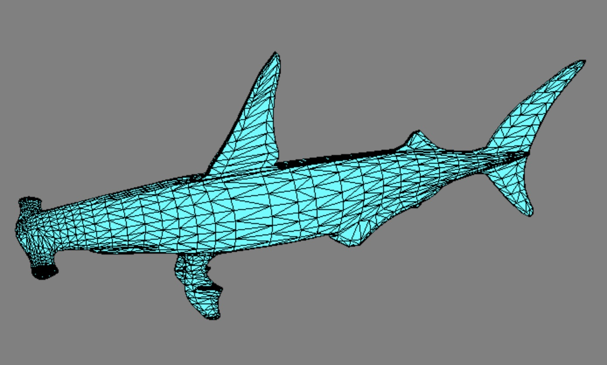

# Hammerhead.gl

A 3D renderer written in TypeScript and WebGPU.

<div align="center">
    
</div>

<br>

<div align="center">
    <a href="https://img.shields.io/github/license/sguimmara/hammerhead.gl"></a>
    <a href="https://img.shields.io/github/actions/workflow/status/sguimmara  /hammerhead.gl/main.yml"></a>
    <a href="https://codecov.io/gh/sguimmara/hammerhead.gl" >
    
    </a>
</div>

## :shark: Features

- :pen: Strongly typed API
- :fireworks: Post-processing effects built-in the rendering pipeline

## 🚀 Getting started

To open the example page:

```shell
npm install
npm run start
```
